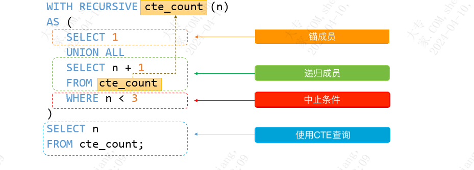

| operator | createtime | updatetime |
| ---- | ---- | ---- |
| shenx | 2024-4月-10 | 2024-4月-10  |
| ... | ... | ... |
---
# mysql 递归CTE 解决层级关系

[mysql 递归CTE](https://www.begtut.com/mysql/mysql-recursive-cte.html)

```sql
-- 自测例子
CREATE TABLE  sx_test.manager_slave (`id` int NOT NULL AUTO_INCREMENT, manager_id int  DEFAULT NULL ,PRIMARY KEY (`id`))
INSERT sx_test.manager_slave(id) VALUES (1),(2),(3),(4),(5),(6),(7),(8),(9);
INSERT sx_test.manager_slave(id,manager_id) VALUES (11,1),(12,2),(13,3),(14,4),(15,5),(16,6),(17,7),(18,8),(19,9);
INSERT sx_test.manager_slave(id,manager_id) VALUES (21,11),(22,12),(23,13),(24,14),(25,15),(26,16),(27,17),(28,18),(29,19);
INSERT sx_test.manager_slave(id,manager_id) VALUES (31,21),(32,22),(33,23),(34,24),(35,25),(36,26),(37,27),(38,28),(39,29);

WITH  RECURSIVE  get_slave AS (
SELECT  id ,manager_id FROM  sx_test.manager_slave AS ms_s WHERE manager_id IS  null  AND  id =1
UNION ALL 
SELECT ms.id ,ms.manager_id FROM  sx_test.manager_slave  ms 
INNER JOIN get_slave gs 
ON gs.id = ms.manager_id )
SELECT * FROM get_slave ;

```


三要素：
**锚成员**
**递归成员**
**终止条件**


