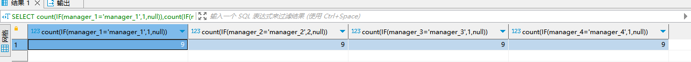

| operator | createtime | updatetime |
| ---- | ---- | ---- |
| shenx | 2024-4月-10 | 2024-4月-10  |
| ... | ... | ... |
---
# 拆分sql逻辑，让sql更容易理解

[toc]

## CTE
```sql
with toronto_ppl as (
   SELECT DISTINCT name
   FROM population
   WHERE country = "Canada"
         AND city = "Toronto"
)
, avg_female_salary as (
   SELECT AVG(salary) as avgSalary
   FROM salaries
   WHERE gender = "Female"
)
SELECT name
       , salary
FROM People
WHERE name in (SELECT DISTINCT FROM toronto_ppl)
      AND salary >= (SELECT avgSalary FROM avg_female_salary)
```

## 临时函数
```sql
CREATE TEMPORARY FUNCTION get_seniority(tenure INT64) AS (
   CASE WHEN tenure < 1 THEN "analyst"
        WHEN tenure BETWEEN 1 and 3 THEN "associate"
        WHEN tenure BETWEEN 3 and 5 THEN "senior"
        WHEN tenure > 5 THEN "vp"
        ELSE "n/a"
   END
);
SELECT name
       , get_seniority(tenure) as seniority
FROM employees
```

## 行列互转
[行列互转](https://blog.csdn.net/javaanddonet/article/details/110427437)

|行转列 | 列转行 |
| ---- | ---- |
|case when 添加行，聚合函数 缩减多出的null 数据 | 列转行使用union |
| case when 添加行，group_concat 将数据合并 | substring_index |

```sql
例子：
CREATE TABLE  sx_test.manager_slave (`id` int NOT NULL AUTO_INCREMENT, manager_id int  DEFAULT NULL ,PRIMARY KEY (`id`))
INSERT sx_test.manager_slave(id) VALUES (1),(2),(3),(4),(5),(6),(7),(8),(9);
INSERT sx_test.manager_slave(id,manager_id) VALUES (11,1),(12,2),(13,3),(14,4),(15,5),(16,6),(17,7),(18,8),(19,9);
INSERT sx_test.manager_slave(id,manager_id) VALUES (21,11),(22,12),(23,13),(24,14),(25,15),(26,16),(27,17),(28,18),(29,19);
INSERT sx_test.manager_slave(id,manager_id) VALUES (31,21),(32,22),(33,23),(34,24),(35,25),(36,26),(37,27),(38,28),(39,29);

行转列
SELECT count(IF(manager_1='manager_1',1,null)),count(IF(manager_2='manager_2',2,null)),count(IF(manager_3='manager_3',1,null)),count(IF(manager_4='manager_4',1,null)) FROM 
(SELECT id,manager_id,
	   CASE WHEN id < 10 THEN 'manager_1' END AS manager_1,
	   CASE WHEN id >10 AND id <20 THEN 'manager_2' END AS manager_2,
	   CASE WHEN id >20 AND id <30 THEN 'manager_3' END AS manager_3,
	   CASE WHEN id >30 AND id <40 THEN 'manager_4' END AS manager_4
FROM sx_test.manager_slave ) t
```



## 同比问题
需要查找与同期的对比信息时，入增长率，增加值等

使用**自连接**

mysql8.0.2后使用可以使用**开窗函数** lag(),lead()
lag() 表示当前行往上比较
lead() 表示当前行往下比较

`LAG ( expression[, offset ] [, default ] ) OVER ( partition by... order by...  )`
**expression**：字段名;<br>
**offset**：偏移量，上（下）1行或N行;<br>
**default**：函数取上N/下N个值，当在表中从当前行位置向前数N行已经超出了表的范围时，default作为函数的默认返回值，若无指定默认值，则返回NULL。

例:
```sql
# Comparing each month's sales to last month  
SELECT month  
       , sales  
       , sales - LAG(sales, 1) OVER (ORDER BY month)  
FROM monthly_sales  
# Comparing each month's sales to the same month last year  
SELECT month  
       , sales  
       , sales - LAG(sales, 12) OVER (ORDER BY month)  
FROM monthly_sales
```
