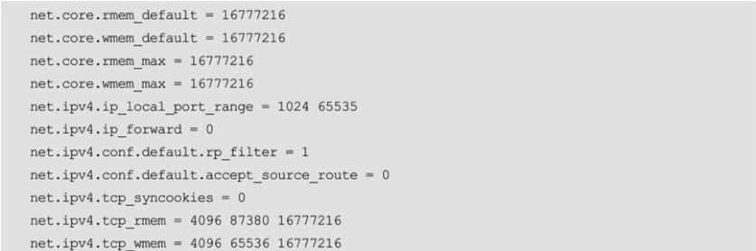
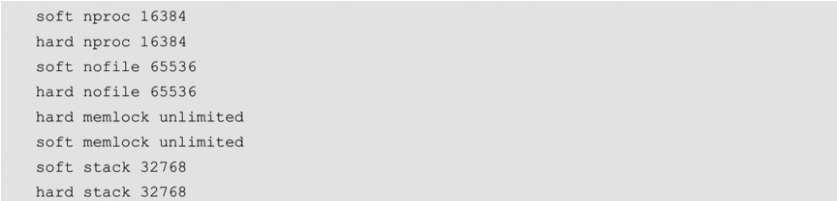

# mysql cpu 优化 (节选自mysql性能优化金字塔)

## cpu
### centos7 关闭cpu 节能模式


要在 CentOS 7 中关闭 CPU 节能模式，你可以按照以下步骤进行操作：

打开终端，并使用管理员权限登录到系统。

编辑 /etc/default/grub 文件。可以使用任何文本编辑器打开该文件，比如使用 vim 命令：

`sudo vim /etc/default/grub`
在打开的文件中，找到名为 GRUB_CMDLINE_LINUX 的行。该行包含了内核启动参数。

在 GRUB_CMDLINE_LINUX 行的引号内，添加 intel_pstate=disable 参数。该参数用于禁用 Intel P-state 功能，这是一种 CPU 节能模式。

例如，修改后的 GRUB_CMDLINE_LINUX 行可能如下所示：


`GRUB_CMDLINE_LINUX="intel_pstate=disable"`
保存文件并退出文本编辑器。

更新 GRUB 配置，以使修改生效。运行以下命令：

`sudo grub2-mkconfig -o /boot/grub2/grub.cfg`
重新启动系统，以应用修改后的内核参数。

在系统重新启动后，CPU 节能模式将被禁用。你可以使用 cpupower frequency-info 命令来验证节能模式是否已关闭。

请注意，禁用 CPU 节能模式可能会导致系统功耗增加和温度升高。这可能对某些系统或环境不适用。在做出更改之前，请确保了解其可能的影响。


## 内存
### 关闭numa

• 在操作系统内核启动时关闭NUMA。在操作系统中关闭，可以直接在/etc/grub.conf
文件的kernel行的最后添加numa=off。并且在sysctl.conf文件中设置
vm.zone_reclaim_mode=0尽量回收内存。


• 在进程启动时关闭NUMA。在启动MySQL时关闭NUMA特性
numactl --interleave=off mysqld &

### swappiness
• 设置较小的vm.swappiness值
vm.swappiness是操作系统控制物理内存交换的策略，它的值是一个百分比数，最小
值为0，最大值为100，默认值为60。将vm.swappiness设置为0表示尽量少交换，设置为
100表示尽量将inactive内存交换出去。在MySQL所在的服务器中建议设置
vm.swappiness=10。

### 考虑开启大页

在 Linux 系统上启用大页（Huge Pages）功能可以对 MySQL 的性能产生积极影响。大页是一种内存管理技术，它允许将连续的物理内存页面映射到连续的虚拟内存页面，从而提高内存访问的效率。

当你启用大页功能并为 MySQL 分配大页时，它可能会对 MySQL 的性能产生以下影响：

减少内存碎片化：使用大页可以减少内存碎片化，从而提高内存的利用率。这可以降低内存分配和释放的开销，减少内存管理的负担。

减少 TLB 缓存失效：TLB（Translation Lookaside Buffer）是 CPU 中的一种缓存，用于加速虚拟内存到物理内存的转换。使用大页可以减少 TLB 缓存失效的次数，从而提高内存访问的效率。

提高查询性能：大页可以降低内存访问的延迟，从而提高查询性能。特别是对于大型数据库和复杂查询，大页可以提供更好的性能优势。

要启用大页功能并为 MySQL 分配大页，你需要进行以下步骤：

确保你的 Linux 内核支持大页功能，并已启用。

在 MySQL 的配置文件中，将 innodb_use_native_aio 参数设置为 0。


`innodb_use_native_aio = 0`
在系统启动时分配大页。你可以通过编辑 /etc/sysctl.conf 文件，并添加以下行来配置大页数量：


`vm.nr_hugepages = <number_of_hugepages>`
<number_of_hugepages> 是你希望为 MySQL 分配的大页数量。

重新启动系统，以使配置更改生效。

启用大页功能可能需要对系统进行一些调整和优化，具体取决于你的硬件和操作系统配置。你可以参考你所使用的 Linux 发行版的文档或相关资源，了解更多关于大页配置和优化的详细信息。

总的来说，启用大页功能可以提高 MySQL 的内存访问效率和查询性能。然而，实际的性能提升效果取决于多个因素，包括数据库的大小、负载模式和硬件配置等。

### 将调度策略设置为Deadline

在 Linux 中，磁盘调度策略用于优化磁盘访问和提高系统性能。以下是几种常见的磁盘调度策略：

CFQ（Completely Fair Queuing）：CFQ 是 Linux 内核默认的磁盘调度策略。它基于队列的方式，根据进程的 IO 请求进行调度。CFQ 着重于公平性，尽量平衡不同进程的 IO 负载，适用于大多数常规工作负载。

Deadline：Deadline 磁盘调度策略通过设置 IO 请求的截止期限来调度磁盘访问。它旨在提供低延迟和快速响应时间，适用于对响应时间敏感的工作负载，如交互式应用和数据库。

NOOP：NOOP 是一种简单的磁盘调度策略，它按照 IO 请求的顺序进行调度，不做额外的调度决策。NOOP 适用于某些特定的场景，如闪存设备（SSD）等，因为这些设备已经具备了自己的内部调度算法。

你可以通过以下方法之一来更改磁盘调度策略：

通过 echo 命令将调度策略写入磁盘的调度器文件中。例如，要将调度策略设置为 Deadline，可以运行以下命令：

```bash
echo deadline > /sys/block/{device_name}/queue/scheduler
```
将 {device_name} 替换为你要设置调度策略的设备名称，如 /dev/sda。

编辑 /etc/default/grub 文件，将 GRUB_CMDLINE_LINUX 行中的 elevator=cfq 部分更改为所需的调度策略。然后保存文件并更新 GRUB 配置。

使用专门的工具，如 tuned 或 sysctl，来更改磁盘调度策略。

请注意，磁盘调度策略的选择应该根据具体的硬件和工作负载进行评估和测试，以获得最佳的性能和响应时间。


## 网络

### 反向域名解析
skip_name_resolve=on

### 关闭iptables和SELinux

很多数据安全公司提供的检查项都建议在数据库服务器上开启iptables或者SELinux。
但是对于高并发和大压力情况下的MySQL数据库来说，开启了iptables会造成队列满，开
启了SELinux会导致MySQL访问文件权限出现问题，远远大于所谓的安全检查项带来的好
处。采用SSH登录端口修改，在网络交换机上设置安全策略比在数据库上开启iptables和
SELinux要好得多

### 网卡多队列避免CPU的IRQ瓶颈

使用mpstat查看信息
看soft IRQ占用
如果某一个占用很高，可以考虑将IRQ手动分配到不同的cpu,或者更换支持多队列的网卡

### 在短连接下降低TIME_WAIT Socket连接
net.ipv4.tcp_keepalive_time 可以设置的小一点 ，太小会导致频繁的发心跳包，太打导致TCP连接不能及时释放(应用端没有显示断开连接，意外中断的连接)，导致连接的浪费

### 更新


## 其他

### 进程资源
/etc/security/limits.conf
