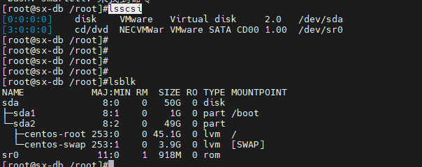
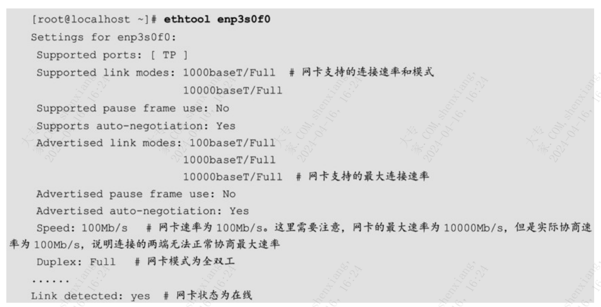

| operator | createtime | updatetime |
| ---- | ---- | ---- |
| shenx | 2024-4月-11 | 2024-4月-11  |
| ... | ... | ... |
---
# 调优金字塔工具篇.md

[toc]

## 硬件查看

### 通用
#### lshw 
```bash
硬件列表器 (lshw) -
用法：lshw [-格式] [-选项 ...]
       lshw -版本

        -版本        打印程序版本 ()

格式可以是
        -html           以HTML形式输出硬件树
        -xml            以XML形式输出硬件树
        -json           以JSON对象的形式输出硬件树
        -short          输出硬件路径
        -businfo        输出总线信息

选项可以是
        -class CLASS    只显示某一类的硬件
        -C CLASS        与 '-class CLASS' 相同
        -c CLASS        与 '-class CLASS' 相同
        -disable TEST   禁用一个测试（如 pci, isapnp, cpuid等）
        -enable TEST    启用一个测试（如 pci, isapnp, cpuid等）
        -quiet          不显示状态
        -sanitize       清理输出（移除敏感信息，如序列号等）
        -numeric        输出数字ID（对于PCI，USB等）
        -notime         从输出中排除易变属性（时间戳） 
```

例子  
`lshw -short `  
`lshw -class memory`

#### dmidecode
使用dmidecode命令可以读取/dev/mem二进制文件并进行解析，然后以人类可读的格
式转储计算机的DMI（或者SMBIOS）表内容，该表中包含了系统硬件组件的描述，以及
其他有用的信息（例如：BIOS 序列号和版本信息）。借助此表的信息，虽然可以不需要
实际去机房查看硬件的型号，但是这也使得查询的信息**可能不可靠**。 

`dmidecode [option]`  
例子  
`dmidecode -s `  
`dmidecode -t `


#### dmesg
dmesg命令用于打印或控制内核环形缓冲区（Kernel Ring Buffer）的内容

### cpu
#### lscpu

### 磁盘相关命令
#### smartctl
使用该命令只能查看到裸盘设备的型号信息，如果是阵列卡，则只能看到阵列卡型号；**如果是PCIe Flash SSD设备，则可能不支持查看相关信息。**

#### lsscsi 与 lsblk



### 网卡
#### lspci
查看网卡型号等
`lspci [option]`

#### ethtool
使用ethtool命令可以查看或控制网络驱动程序，且可以**对网络设备的配置信息进行设置**。
`ethtool [option] devname`
devname 可以通过ip addr获得



---

## 系统负载查看（重要）
### top
使用top命令可以查看正在运行的系统中的动态实时视图信息，显示系统摘要信息，
以及Linux内核当前正在管理的任务列表。  

命令行重要选项：  
-H：打印线程信息（在默认情况下，top只显示进程信息）

交互模式常用  （注意大小写）
* **S**：累计模式，会把已完成或退出的子进程占用的CPU时间累计到父进程。
* **P**：按%CPU排行。
* **T**：按TIME+排行。 
* **M**：按%MEM排行。
* **i**：只显示正在运行的进程。
* **k**：kill进程。
* **r**：修改进程renice值。-- 不知有没用

### dstat
该命令由 dstat软件包提供。  
`dstat [-afv] [option] [delay [count]] `
* -c, --cpu：开启CPU使用率状态信息。
* -d, --disk：开启磁盘吞吐状态信息。
* --aio：开启AIO状态信息。
* --fs,--filesystem：开启文件系统状态信息，即当前打开的文件数量和已使用的inode数量。
* --ipc：开启IPC状态信息。
* -m, --mem：开启内存状态信息。
* -n, --net：开启网络流量状态信息。

### mpstat
`mpstat [interval [count]]`  
使用mpstat命令可以输出较为详细的CPU统计信息。  
该命令由sysstat软件包提供

### sar
使用sar命令可以收集并打印系统中各种活动的详细信息。
该命令由sysstat软件包提供


