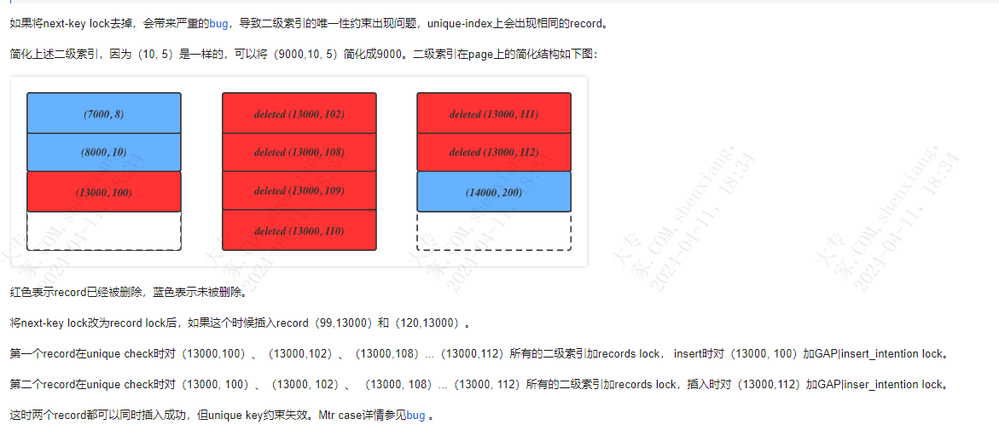

| operator | createtime | updatetime |
| ---- | ---- | ---- |
| shenx | 2024-4月-11 | 2024-4月-11  |
| ... | ... | ... |
---
# 分析MySQL unique key check问题(插入意向锁导致的gap锁).md

[toc]

原文  
[插入意向锁导致的gap锁](https://help.aliyun.com/zh/polardb/polardb-for-mysql/resolve-the-unique-key-check-problem-in-mysql)


可以看出，在二级唯一索引插入record时，分成了两个阶段。

1. 判断当前的物理记录上是否有冲突的record（delete-marked 是不冲突）。

2. 如果没有冲突，执行插入操作。

阶段1和阶段2之间必须有锁来保证（可以是lock，也可以是latch）。否则，阶段1判断没有冲突可以执行插入操作，但在阶段1和阶段2之间另外一个事务插入了一个冲突的record，那么阶段2再插入时，会产生冲突。

所以当前的实现为：如果gap上存在至少一个相同的record，**大概率是delete-marked record。那么，需要给整个range都加上gap X lock**。加了gap X lock后，就可以禁止其他事务在这个gap区间插入数据，也就是通过lock来保证阶段1和阶段2的原子性。

如果gap上没有相同的record，那么就不需要任何gap lock。例如，一个只包含pk、sk的table。


--- 

**为什么需要给整个区间都加入gap x lock呢？** 
```已经存在的二级索引记录（1, 1）、（4, 2）、（10(delete-mark)，3）、（10(d), 8）、（10(d), 11）、（10(d), 21）和（15, 9）需要插入二级索引（10, 6），那么就需要给（10,3）、（10, 8）、（10,11）、（10,21）和（15, 9） 都加上next-key lock。```

整个区间的记录都要加上next-key lock 
因为如果只在插入记录的后一条记录加，会就导致，插入不同的记录锁住的是不同区间，可能会导致unique key约束失效。



--- 

**执行INSERT操作时，为什么要持有LOCK_GAP而不是LOCK_ORDINARY？**  
例如，原来已经存在record 1、4、10，需要插入record 6、7。

Trx抢的是record 10的lock，且record 10是next record。此时record6、7 都还未在Btree中，如果为record 10加上LOCK_ORDINARY，那么插入record 6、7 就会互相等待死锁。因此只能为record 10加LOCK_GAP。

对于有可能冲突的sk，会出现互相等待死锁的现象。

例如，如果现有record（1,1）、（4,2）、（10(delete-mark),3）、 （10(d),8）、（10(d),11）、 （10(d),21）、（15,9）。需要插入trx1:（10,6）、trx2:（10,7）。您需要在trx1插入成功后，再插入trx2。

首先，您需要给（10,3）、（10,8）、（10,11）和（10,21）加records lock。插入的位置是在（10,3）和（10,8）之间，那么在申请（10,8）的LOCK_X | LOCK_ORDINARY | insert_intention时，和已经持有的records lock互相冲突，处于死锁状态。

插入（10,6）和（10,9）也一样，需要给所有（10,x）都加records lock。插入时trx1申请（10, 8）的LOCK_ORDINARY，且持有trx2需要的（10, 11）的records lock。trx2申请（10, 11）的LOCK_X 或LOCK_ORDINARY，持有trx1想要的（10, 8）的records lock。因此也会出现死锁冲突。

--- 

**Primary key也是unique key index，为什么primary key不存在此问题？**

在secondary index中，由于MVCC的存在，当删除一个record，再在插入一个新的record时，保留delete marked record。

在primary index中，DELETE后又INSERT一个数据，会将该record delete marked标记修改为non-delete marked，然后在undo log中记录一个delete marked的record。如果查询历史版本，会通过MVCC从undo log中恢复该数据。因此，不会出现相同的delete mark record跨多个page的情况，也就不会出现上述case中（13000,100）在page1, （13000,112）在page3的情况。