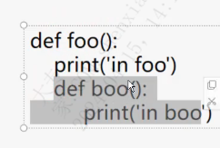
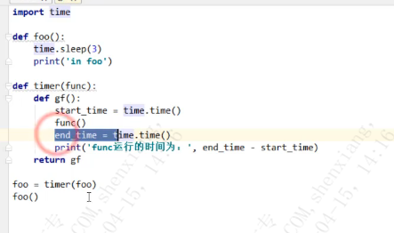

| operator | createtime | updatetime |
| ---- | ---- | ---- |
| shenx | 2024-4月-15 | 2024-4月-15  |
| ... | ... | ... |
---
# python 进阶教程 -- 装饰器与闭包

[toc]

## 装饰器
定义: 用来装饰其他函数的，为被装饰函数添加特定功能的函数。

装饰器修饰的方法
例子：

面向对象编程三种方法：
类方法: @classmethod
静态方法: @staticmethod
实例方法: 没有被装饰器修饰

> 类方法使用@classmethod装饰器，第一个参数是cls，用于访问类级别的属性。
> 静态方法使用@staticmethod装饰器，它们与类和实例无关，通常用于执行与类相关但不需要访问类状态的操作。
> 实例方法使用self作为第一个参数，用于访问和修改实例的状态。


[python 面向对象方法类型](https://blog.csdn.net/New_Teen/article/details/134611409)


### 装饰器函数的基本原则
1. 装饰器不能修改被装饰函数的源码。
2. 装饰器不能改变被装饰函数的调用方式。

任务： 编写一个装饰器，要求统计被装饰的函数的运行时间。

#### 前置科技
函数即变量  
高阶函数  
嵌套函数  

装饰器 = 高阶函数 + 嵌套函数

---

**函数即变量**
函数的本质是一串字符串，函数名是一个变量，指向了该内存区域，可以通过函数名来赋值。

**高阶函数**
定义:  
接收函数名作为参数，或者返回值中包含函数名

函数名作为参数作用，在运行参数函数前后，附加功能。
为什么不是装饰器-- 因为会改变表参数函数的调用方式

返回值中包含函数名-- 不改变被装饰函数的调用方式。

**嵌套函数**
通过def 关键字**定义在另外一个函数中**的函数叫嵌套函数


高阶函数 + 嵌套函数


#### 几种装饰器
**装饰器需要修饰带有参数函数**

日志装饰器模板:  
```python
def log_decorator(func):
    """提示输出，错误处理统一入口，用于所有函数调用"""
    @functools.wraps(func)
    def wrapper(*args, **kwargs):
        logger.info(f'--------------- 开始执行函数 {func.__name__}')
        try:
            result = func(*args, **kwargs)
            if result:
                logger.info(f'--------------- {func.__name__} 执行成功')
            else:
                raise Exception(f'--------------- {func.__name__} 执行失败')
            return result
        except Exception as e:
            pass
            exit(0)
        except subprocess.CalledProcessError as e:
            pass
            exit(0)
    return wrapper
```

**装饰器本身带有参数**
```python
def timer(time_type):
    print(timer_type)
    def outer(func)
        def gf(*args,**kwargs):
            start_time=time.time()
            func(*args,**kwargs)
            end_time=time.time()
            print(func执行时间：end_time-start_time)
        return gf
    return outer

@timer(timr_type='minites')
def foo(name,age):
    time.sleep(3)
    print("in foo",name ,age)
```

**被装饰函数带有返回值**
这个模板就ok ,在嵌套函数中返回(因为最内层的嵌套函数将会被赋值给被装饰函数)
```python
def log_decorator(func):
    """提示输出，错误处理统一入口，用于所有函数调用"""
    @functools.wraps(func)
    def wrapper(*args, **kwargs):
        logger.info(f'--------------- 开始执行函数 {func.__name__}')
        try:
            result = func(*args, **kwargs)
            if result:
                logger.info(f'--------------- {func.__name__} 执行成功')
            else:
                raise Exception(f'--------------- {func.__name__} 执行失败')
            return result
        except Exception as e:
            pass
            exit(0)
        except subprocess.CalledProcessError as e:
            pass
            exit(0)
    return wrapper
```

## 闭包
作用：
用来一个在一个函数与一组私有变量间创建关联，在给定函数多次调用的过程中，这些私有变量能保持其持久性。（保持运行与变量的状态）。 

例子：
未使用闭包：
```python
func_list = []
for i in range(3):
    def myfunc(a):
        return i+a
    func_list.append(myfunc)

for f in func_list:
    print(f(1))

结果：
3
3
3
```
使用闭包
```python
func_list = []
for i in range(3):
    def deco(i)
        def myfunc(a):
            return i+a
        return myfunc
    func_list.append(deco(i))

for f in func_list:
    print(f(1))

结果：
1
2
3
```

闭包的特性：  
* 必须要有函数嵌套，且外层函数必须返回内层函数
* 内层函数中要用到外层函数定义的自由变量

闭包和装饰器的异同
| | 装饰器 | 闭包 |
| ---- | ---- | ---- |
| 同 | 1.都是函数嵌套，内外层函数，且外层函数要返回内层函数 |  |
| 同 | 2.代码实现逻辑类似 |
| 同 | 3.两者都可以实现增加额外功能 |
| 异 | 1.外层函数成为装饰器 | 外层函数称为闭包 |
| 异 | 2.装饰器的外层函数主要的提供被装饰函数的引用 | 闭包的外层函数主要是为了提供自由变量 | 
| 异 | 3.装饰器的外城函数不一定变量 | 闭包的外层函数必须提供自由变量，否则闭包无意义 |
| 异 | 4.装饰器的目的：为被装饰函数提供额外的功能 | 保存的目的是保存函数运行环境和局部变量值 |
| 异 | 5.形式上看，闭包是装饰器的子集 |  |


