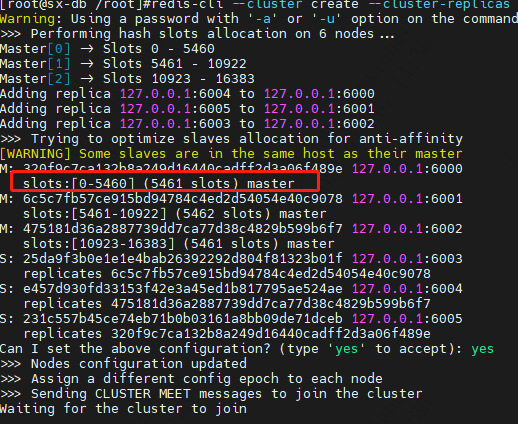

| operator | createtime | updatetime |
| ---- | ---- | ---- |
| shenx | 2024-3月-21 | 2024-3月-21  |
| ... | ... | ... |
---
# redis 系统学习

[toc]

## 1.redis我们应该考虑哪些点

1.数据丢失问题  - RDB与AOF <br>
2.并发问题 -- 主从同步读写分离 <br>
3.故障恢复问题 哨兵 <br>
4.存储能力问题 <br>

单节点对上述问题明显支持不足

## 2.redis数据持久化
***RDB 持久化***<br>
save 与 bgsave  
save 前台rdb ,会在主动关闭redis的时候自动执行  
bgsave 后台rdb  

相关配置
```bash
save 3600 1
rdbcommpression yes/no
dbfilename ""
dir ""
```

***AOF 日志***<br>
默认关闭<br>
相关配置
```bash
appendonly yes
appendfilename ""

appendfsync always # 每有写命令，即触发sync
appendfsync everyesc # 写命令先放aof缓冲区，每秒刷新到磁盘文件
appendfsync no  # 写命令先放aof缓冲区，等待操作系统决定合适写入磁盘
```

AOF 重写<br>
bgrewriteaof 
AOF触发重写的配置<br> 
```bash
auto-aof-rewrite-percentage 100  # 比上次文件增加超过多少百分比触发重写<br> 
auto-aof-rewrite-min-size 64mb # 文件大小大于多少触发重写
```

### RDB 原理
流程<br>
1. fork一个子进程，共享内存空间
2. 子进程读取内存数据，写入磁盘
3. 写完成，用新的rdb文件替换旧的rdb文件

copy_on_write
* 主进程执行只读操作时，读取共享内存。（此时内存数据为只读）
* 主进程执行写操作时，会copy一份数据，执行写操作。

### 未解决的问题
1. **存在数据丢失风险**：在rdb触发的间隔，和触发过程中新写入的数据时没有被持久化的。一旦down机，会有部分数据丢失。
2. **代价相对较大**：fork ,压缩，写大量磁盘文件花费都很大

### AOF原理
将所有的redis写操作记录到aof文件中，关键词**追加**，**写操作**。为了避免文件过大，和执行无用的记录，秩序记录最后一条对key的写命令即可，所以有了rewrite操作。


## 3.主从同步


复制缓冲区写满问题
: redis 的复制缓冲区repl_baklog 可能写满，而主从由于RDB,网络等原因，从库与主库的数据差距大于repl_baklog最大的空间限制，导致，主从失败。

>对主从的优化<br>
> 从减少RDB成本角度<br>
>> *  在master上配置，repl-diskless-sync yes #在主从同步时不对RDB文件落盘，而是直接发送到从库
>> * redis 内存上限，减少RDB,IO消耗的时间<br>
>
> 从其他角度<br>
>> * 增加repl_baklog的大小，发现从宕机尽快恢复，避免出现全量同步
>> * master 的从库太多，可以采用，链式复制，减少主库压力

## 4.哨兵模式
 **哨兵的作用**<br>
 * 监控节点运行状态
 * 故障转移(主节点变更)
 * 通知master变更(从节点切换master)

**如何判定一个节点已经下线**
* 主观下线
    : 一个哨兵节点ping 节点，超过指定时间(down-after-milliseconds)没有返回。
* 客观下线
    : 超过指定数量(**quorum**)的哨兵节点判定一个节点主观下线,一般 **quorum** 为哨兵节点的一半.<br>
    ```bash
    sentinel monitor mymaster 127.0.0.1 6379 2
    ```
    此处的2就是**quorum**

**哨兵选主机制**
1. 节点下线时间超过down-after-milliseconds*10，失去选主资格<br>
2. 节点优先级slave-priority 数字越低的优先级越高，如果为0则不参与选举，默认值为1<br>
3. slave_priority一样,slave节点的offset值越大，说明与master数据差距越小，优先级越高 <br>
4. offset 一样，判断redis 的run_id,越小优先级越高。

**故障转移步骤**
1. sentinel 给被选主流程选中的slave 发送 salveof no one 将其提升为主
2. sentinel 给其他节点发送slaveof 新主的ip 端口，切换其他slave 的master
3. 给故障节点发送 slaveof 新主的ip 端口 ,故障节点恢复后成为新master 的slave

## 5.redis 集群模式
### 搭建
[集群搭建(docker)搭建](redis_cluster搭建.md)

### 散列插槽slot
key 去有效部分通过CRC16算法计算hash值，再与16384取余，分配插槽<br>

有效部分
: key 值包含{},，且{}包括至少一个字符，{}中的内容为有效部分；
：key 值不包含{}，则整个key为有效部分



**如何将同一类key保存到同一个redis实例上？**<br>
控制key 的有效部分，灵活使用{}，例如使用{typeid}作为前缀

## 集群伸缩
redis-cli --cluster --help

### 插槽迁移(手动插槽平衡)
[Redis Cluster数据迁移会阻塞吗？](https://learn.lianglianglee.com/%E4%B8%93%E6%A0%8F/Redis%20%E6%BA%90%E7%A0%81%E5%89%96%E6%9E%90%E4%B8%8E%E5%AE%9E%E6%88%98/28%20%20Redis%20Cluster%E6%95%B0%E6%8D%AE%E8%BF%81%E7%A7%BB%E4%BC%9A%E9%98%BB%E5%A1%9E%E5%90%97%EF%BC%9F.md)

五步走
* 标记迁入、迁出节点；
* 获取待迁出的 keys；
* 源节点实际迁移数据；
* 目的节点处理迁移数据；
* 标记迁移结果。

> 需要注意的是<br>
>> 一是，Redis Cluster 在执行数据迁移时，会调用 syncWrite 和 syncReadLine 函数，向目的节点同步发送迁移数据，以及同步读取回复结果。而这个同步写和同步读的过程，会阻塞源节点正常处理请求。所以，你在迁移数据时要控制迁移的 key 数量和 key 大小，避免一次性迁移过多的 key 或是过大的 key，而导致 Redis 阻塞。<br>
> 
>> 二是，我们在实际应用中，会用到 redis-cli 工具，或者是 Ruby 开发的 Redis Cluster 集群运维工具 redis-trib，来执行数据迁移。这些工具最终也会调用这节课中，我们介绍的命令来完成数据的实际迁移。所以，学习今天课程的内容，对于你在实际应用中，从代码层面排查 redis-cli、redis-trib 这些工具的问题也是有所帮助的。

## 故障切换

**自动故障转移**
cluster 会自动监控master节点的故障,在失败后提升一个slave为主，失败节点重新加入集群后会降级为slave

**手动故障转移**


替换的模式
1. 缺省 1-6步一次进行
2. force 省略offset的校验
3. takeover 直接执行第五步，忽略数据一致性，忽略master状态和其他master的意见

## 多级缓存


### JVM 进程缓存
[多级缓存学习视频](https://www.bilibili.com/video/BV1xF411R7Z9/?p=18&vd_source=8fb3a82a92eebdb73fc7444aebb1a21e)

### lua脚本
[多级缓存学习视频](https://www.bilibili.com/video/BV1xF411R7Z9/?p=18&vd_source=8fb3a82a92eebdb73fc7444aebb1a21e)

### 多级缓存的实现
OpenResty 学习
[多级缓存学习视频](https://www.bilibili.com/video/BV1xF411R7Z9/?p=18&vd_source=8fb3a82a92eebdb73fc7444aebb1a21e)

### 缓存同步策略

三种常见的策略
* **设置有效期**,到期删除，重新同步
    * 优势：简单
    * 劣势：时效性差
    * 场景：更新评率低，时效性要求低的业务
* **同步双写**
  * 优势：时效性强，缓存数据库强一致
  * 劣势：有代码侵入，耦合度高
  * 场景：时效性要求高
* **异步通知**
  * 优势：低耦合，可以同时通知多个缓存服务
  * 劣势：时效性一般，可能存在中间状态
  * 场景：时效性要求一般，有多级缓存需要同步
  

异步通知方式两种
: 消息队列

：canal


### canal 方式异步通知

#### canal 安装
[canal 安装](../mysql/工具/canal异步消息通知)

### 多级缓存总结

