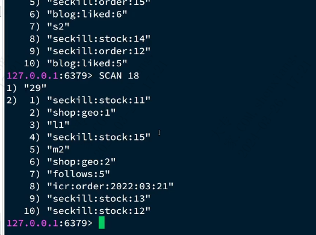
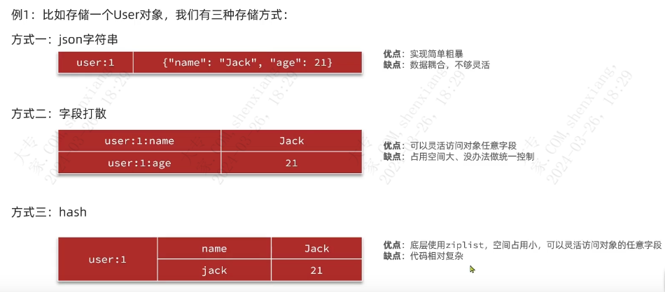
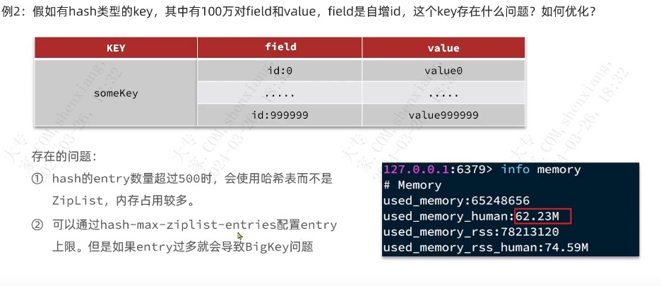
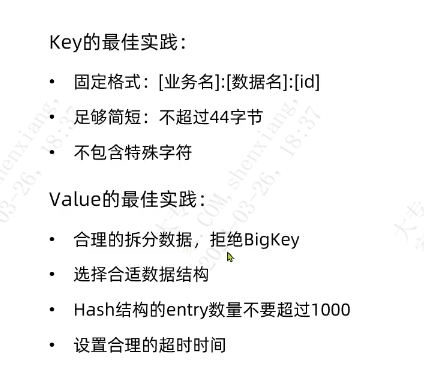
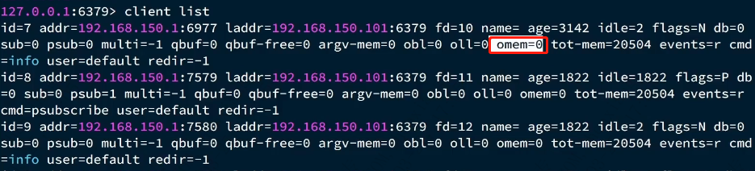

| operator | createtime | updatetime |
| ---- | ---- | ---- |
| shenx | 2024-3月-26 | 2024-3月-26  |
| ... | ... | ... |
---
# redis最佳实践.md

[toc]

## redis键值设计
### 优雅的key结构
key命名规则建议 
* `[业务名称]:[数据名称]:id`
* `长度不超过44`
  * value为 是string类型时，但是底层在存储的时候会使用int,embstr和raw三种编码来存，纯数字key 使用int,小于44字节的key使用embstr（一种紧凑的存储方式），更节省空间
-- 个人感觉这是value的值，并不是key的值。
查看编码类型`object encoding [key]`
* `不包含特殊字符`

### bigkey问题
什么是bigkey
1. 单值key,数据大小很大，例如5mb
2. 集合类型成员多，或者成员很大

推荐(感觉不是很切合实际)
* 单key的value小于10kb
* 集合key,元素数量小于1000

**查看key的大小**
`memory usage [key]` 返回字节数据 ，（占用cpu比较高，**慎用**）
也可以直接通过
len相关命令来，估算key大小，例如 strlen , llen (**建议使用**)

#### **bigkey危害**
* 网络带宽被占用
* 数据倾斜
* redis阻塞
  * 一般是大集合的运算，导致主线程阻塞
* cpu压力
  * 对bigkey的序列化和返序列化是很占cpu的

#### **bigkey发现**
* `redis-cli --bigkeys` 需要扫描全部的key,但是只返回每一种最大类型的最大key。 **慎用**
* scan扫描 ，与key * 不同，scan 通过游标的方式来遍历所有的key,不会导致阻塞
  
* 第三方工具：如redis_rdb_tools 分析rdb文件
* 网络监控

#### **如何处理bigkey**
当bigkey 很大时，直接删除可能会导致主线程阻塞。 
* redis3.0及以下版本 
在删除打的集合时，应该先逐个删除资源 
* redis4.0之后的版本 
使用异步删除命令：unlink

### 恰当的数据类型
对于大量列表类型的存储方式对比

**建议使用hash类型**

2. hash ziplist 存在的问题

如何处理可以见一个大的hash集合，根据规则拆分为多个小的hash集合  

## redis批处理(java端的命令执行方式)
redis 批处理的必要性 
能减少网络传输的次数，减少与redis建立连接的次数。提高服务器峰值处理性能。 
注意不要一次性传输太多命令，否则一次命令占用带宽太大，导致网络阻塞。

### mset等redis 自带的命令与pipeline 的区别
mset redis 自带的命令 使用时有一定的局限性，要求写入的类型的是一致的，在redis 中是在同一条命令中执行；  
pipeline 不是，所以pipeline相对更加灵活

### 集群环境下对批处理命令的限制
要求一次批处理命令中的key要落在同一个插槽中  
这种情况如何改造处理方式 
1. 回归串行执行（别扯淡）
2. 串行slot : 在客户端计算slot，同一个slot的命令放到同一个pipeline，串行执行pipeline
3. 并行solt : 在客户端计算slot，同一个slot的命令放到同一个pipeline，并行执行pipeline(即多线程，同时发送pipeline) **推荐使用**
4. hash_tag ：控制一次批处理命令的hash_tag有效区一致，让它们被分配到同一个slot,但是这样做容易产生**数据倾斜**

## 服务端优化
### 持久化配置
1. 根据redis的使用场景决定是否开启rdb,对于用作纯缓存的redis,可以不开启RDB
2. 对数数据实时性要求不高的redis服务器，可以不开启RDB，使用定时任务的方式，手动执行RDB过程
3. 设置合理的rewrite的阈值，避免频繁rewrite

**部署相关** 
1. redis 服务器留够内存，应对fork与rewrite
2. redis 内存上限不要给过大，甚至可以单机多redis实例，可以尽快RDB过程，减少主从同步，数据迁移压力
3. 不要与cpu,io压力大的服务部署在一起，例如数据库，消息队列

### 慢查询
slowlog-log-slower-than：慢查询阈值，单位微妙，建议1000 即 1 毫秒  

slowlog len 获取长度  
slowlog GET [n] n 条数  
slowlog reset 清空  

### redis 安全要求
1. 密码必须设置，复合常见的密码安全要求  
2. rename-command flushdb cleandb 
rename-command flushall cleanall 
rename-command debug nobug 
rename-command keys nokeyskeys 
rename-command config set  noconfig set
3. bind 绑定网卡，禁止外网网卡访问
4. 开启防火墙
5. 不使用root 账户启动redis
6. 不使用默认redis 端口

### redis 内存配置
数据内存：主要使用内存的方式，关注bigkey问题即可。 
进程内存：redis进程本身使用的内存，占用很少一般几m,对比数据内存可以忽略。 
缓冲区内存：包括**客户端缓冲区**，**复制缓冲区**，**AOF缓冲区**，客户端缓冲区包括**输入缓冲区**，**输出缓冲区**。 

查看内存使用情况
* `info memory`
* `memory [option]`

[memory stats 查看内存使用](https://redis.com.cn/commands/memory-stats.html)

#### 缓冲区内存配置
* 复制缓冲区 
  repl_backlog_buf 设置，如果频繁的出现从库重新全量同步，可以适当调大该值，默认1mb
* AOF缓冲区 
  AOF 刷盘前的缓冲区，也会保存AOF在rewrite时的AOF日志，无法设置容量上限

* 客户端缓冲区 
  分为输入缓冲区，输出缓冲区 
  输入缓冲区默认最大为1GB，无法调整大小 
  输出缓冲区可以自行设置大小 
`client-output-buffer-limit <class> <hard limit> <soft limit> <soft seconds>`
当缓冲区达到上限后会断开当前连接 
`<soft limit> <soft seconds>` 表示 达到soft limit以后，持续soft seconds 才会断开连接 

class 客户端类型 
normal: 普通客户端 
replica：主从复制客户端 
pubsub：发布订阅客户端 

*默认值* 
`client-output-buffer-limit  normal 0 0 0 ` 
`client-output-buffer-limit  replica 256mb 64mb 60 ` 
`client-output-buffer-limit  pubsub 32mb 8mb 60 ` 

`client list` 查看当前与redis建立连接的所有的客户端
可以通过omem=[num] 来判断是否有客户端发生了客户端缓冲区溢出

## 集群最佳实践
### 集群完整性问题
redis默认配置
`cluster-require-full-coverage yes ` 表示当有一个插槽不可用，整个集群都不可用

**建议修改为 no**

### 集群探活导致带宽问题
集群节点通过ping 来确定其他节点的状态，每次都会携带
* 插槽信息
* 集群状态信息
集群节点越多，携带信息量越大，10个节点的ping包就可能达到1kb.

**建议**
1. 避免单个大的集群，可以选择多个小的集群
2. 避免单机运行太多redis 实例
3. 配置合适的`cluster-node-timeout`

对于redis cluster的选择
单机的redis 已经能支持数万级别的qps,评估好是否有必要使用cluster。如无必要误增实体。
