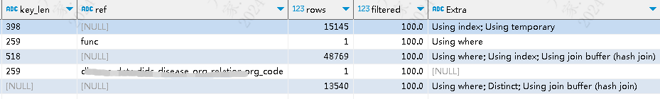
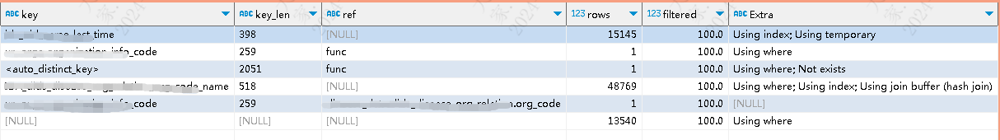

| operator | createtime | updatetime |
| ---- | ---- | ---- |
| shenx | 2024-3月-07 | 2024-3月-07  |
| ... | ... | ... |
---
# sql 优化.md

[toc]

## 1.是 not in 导致的效率慢吗
```sql
select
	distinct(t1.disease_name)'疾病名',
	t1.owner_id '原属组织',
	t2.name '原属组织名',
	t3.org_code '现绑定组织',
	t4.name '现绑定组织名'
FROM disease_data.disease_surveillance_spec t1
	left join org_data.orgs_organization_info t2 
	on concat('org',t1.owner_id) =t2.code
	left join (select CASE WHEN name LIKE '% %' THEN SUBSTRING_INDEX(name, ' ', -1) ELSE name END AS name,org_code 
	           from disease_data.dids_disease_org_relation) t3 
	ON t3.name = t1.disease_name
	left join org_data.orgs_organization_info t4 
	on t3.org_code =t4.code
	LEFT JOIN ( SELECT CASE WHEN t2.disease_name LIKE '% %' THEN SUBSTRING_INDEX(t2.disease_name, ' ', -1) ELSE t2.disease_name END AS result
				FROM disease_data.dids_disease_diagnostic_factor t2 
				where t2.deleted =0 ) t5
	ON t1.disease_name = t5.RESULT 
WHERE t5.RESULT IS null
```



```sql
select
	distinct(t1.disease_name)'疾病名',
	t1.owner_id '原属组织',
	t2.name '原属组织名',
	t3.org_code '现绑定组织',
	t4.name '现绑定组织名'
FROM disease_data.disease_surveillance_spec t1
	left join org_data.orgs_organization_info t2 
	on concat('org',t1.owner_id) =t2.code
	left join (select CASE WHEN name LIKE '% %' THEN SUBSTRING_INDEX(name, ' ', -1) ELSE name END AS name,org_code 
	           from disease_data.dids_disease_org_relation) t3 
	ON t3.name = t1.disease_name
	left join org_data.orgs_organization_info t4 
	on t3.org_code =t4.code
WHERE NOT EXISTS (SELECT CASE WHEN t2.disease_name LIKE '% %' THEN SUBSTRING_INDEX(t2.disease_name, ' ', -1)  ELSE t2.disease_name END AS result
					FROM disease_data.dids_disease_diagnostic_factor t2 
					where t2.deleted =0 AND  t1.disease_name = CASE WHEN t2.disease_name LIKE '% %' THEN SUBSTRING_INDEX(t2.disease_name, ' ', -1) ELSE t2.disease_name END ) 
```


```sql
select
	distinct(t1.disease_name)'疾病名',
	t1.owner_id '原属组织',
	t2.name '原属组织名',
	t3.org_code '现绑定组织',
	t4.name '现绑定组织名'
FROM disease_data.disease_surveillance_spec t1
	left join org_data.orgs_organization_info t2 
	on concat('org',t1.owner_id) =t2.code
	left join (select CASE WHEN name LIKE '% %' THEN SUBSTRING_INDEX(name, ' ', -1) ELSE name END AS name,org_code 
	           from disease_data.dids_disease_org_relation) t3 
	ON t3.name = t1.disease_name
	left join org_data.orgs_organization_info t4 
	on t3.org_code =t4.code
WHERE t1.disease_name  NOT IN ( SELECT CASE WHEN t2.disease_name LIKE '% %' THEN SUBSTRING_INDEX(t2.disease_name, ' ', -1) ELSE t2.disease_name END AS result
								FROM disease_data.dids_disease_diagnostic_factor t2
								where t2.deleted =0 ) 
```


可以看到三种写法的执行计划差距很大
JOIN 走了 HASH_JOIN
NOT EXIST 走了物化视图
NOT IN 走了NEST LOOP JOIN

三者LEFT JOIN 的执行时间与NOT EXIST 类似，大约200ms， NOT IN 几乎不可用,大于5分钟级别。


